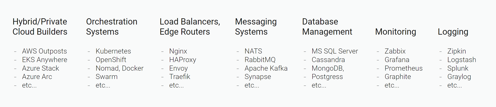

# Introduction

**Voedger** is an all-in-one **server platform** that cuts **backend** development and operation costs up to 10x. Voedger is designed to create and operate the backend of applications that store and process data distributed worldwide.

## Why do you need Voedger?

If you want to **save money and time** - you might need **Voedger**. Why Voedger does save development costs? It replaces or hides the whole modern technology stack that is used to build distributed applications:

There's no need to learn, select, and integrate these technologies. With Voedger, you can focus only on what truly matters for your business. Voedger offers significant advantages to:

**Business Owners**

* Save your money by an order of magnitude.

**Product Owners**

* Direct your team's attention towards business needs rather than on tricky system programming.
* Accelerate feature delivery to weeks instead of months, or months instead of years.

**System Architects**

* **Choosing a technology stack**. You do not need to choose technology stack components. Voedger is all-in-one, no choice.
* **Solution architecture**. Leverage an already developed, efficient architecture.

**Developers**

* **System programming**. Creating users, authentication, authorization, sharding, sync, queues processing, service mesh, logging, monitoring etc. - save your time, it is already implemented.
* **Application programming**. Describe data and data transformations using VSQL. Need more? Easily extend functionality with your own Extensions; the development process is straightforward.
* **Performance optimization**. Comes optimized - caching, sharding, batching, zero memory allocations in hot paths etc.

**DevOps**

* **Be cloud-agnostic**. Just provide nodes running vanilla Linux, and Voedger will do the rest.
* **Deployment**. Zero Downtime Deployment is at your service.
* **Logging and monitoring**. Dashboards, alerts, logs - all in one place, configured and ready to use.

## What can Voedger do?

Voedger platform is perfect to build and operate software aimed to store and process data in multiple clusters around the world. Let's list a few segments where Voedger can be an excellent match:

* Hotel/Restaurant/Cafe management
* Issue/Project management
* Online stores
* Internet of Things
* Messengers, Social networks

## What Voedger is NOT

Voedger is NOT a good choice for **game** and **blockchain** applications since storing data is not a primary goal of such applications or data is kept decentralized.
