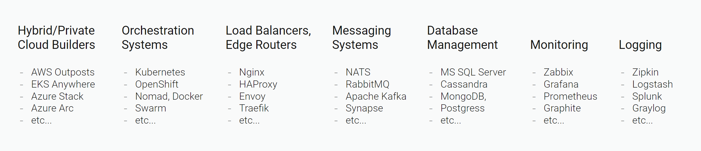

# Introduction

Voedger is an all-in-one platform that cuts backend development and operation costs up to 10x. Primary Voedger usage - build and operate a software that stores and processes data distributed worldwide.

Why Voedger saves development costs? It replaces or hides the whole modern technology stack that is used to build distributed applications:

You should not learn, choose and intergate all these technologies. Just use Voedger and be focused on your business logic. We beleive that Voedger cuts development expenses like this:

| Aspect                 | Using Modern Tech Stack | Cost | With Voedger                     | Cost |
|------------------------|-------------------------|-----:|----------------------------------|-----:|
| **Architecture & Design** | Choose technology stack components | 3    | All-in-one, no choice             | 0    |
|                        | Develop solution architecture | 3    | Effective architecture is already developed, just learn it | 1    |
| **System programming**     | Creating users, authentication, authorization, sharding, sync, queues processing, service mesh, logging, monitoring etc. | 12   | Already implemented              | 0    |
| **Application programming** | Business logic implementation | 15   | Revolutional pi-functions feature and declarative programming saves time and infrastructure costs greatly | 3    |
| **Deployment**             | Continuous/Canary/Blue-Green Deployment | 3    | Already implemented              | 0    |
| **Performance optimization** | Performance optimization of cloud applications can be tricky | 3    | Comes optimized (batching, pipelining, zero memory allocations in hot paths etc.) | 0    |
| **Total** |  | **39**    |  | **4**    |

Voedger platform is great to build and operate software aimed to store and process data in multiple clusters around the world. To name a few areas where Voedger can be a good choice:
- Hotel/Restaurant/Cafe Management
- Issue/Project Management
- Online Stores
- Internet of Things
- Messengers, Social Networks

Voedger is NOT for **gaming** and **blockchains** since storing data is not a primary goal of such applications OR data are kept decentralized.

