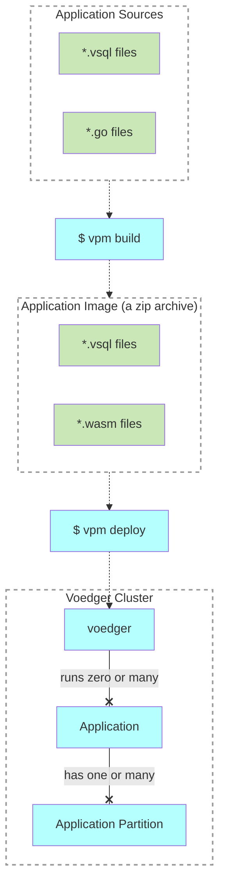

# Applications

- **Voedger Application**: A runtime instance of the software defined by the **Application Image**. Application is partitioned into one or many **Application Partitions**.
- **Application Image**: A ZIP archive containing several *.vsql files that describe the application's data schema (using VSQL language), along with WASM modules.
- **Application Sources**: The original files and resources used to build the Application Image.
- **vpm**: The Voedger Package Manager, a command-line interface (CLI) tool designed to build Application Images from Application Sources.

## Voedger Application lifecycle
