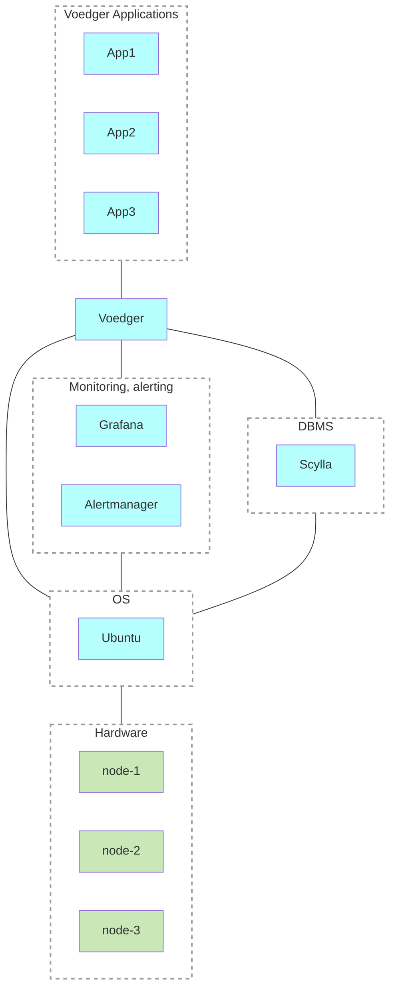
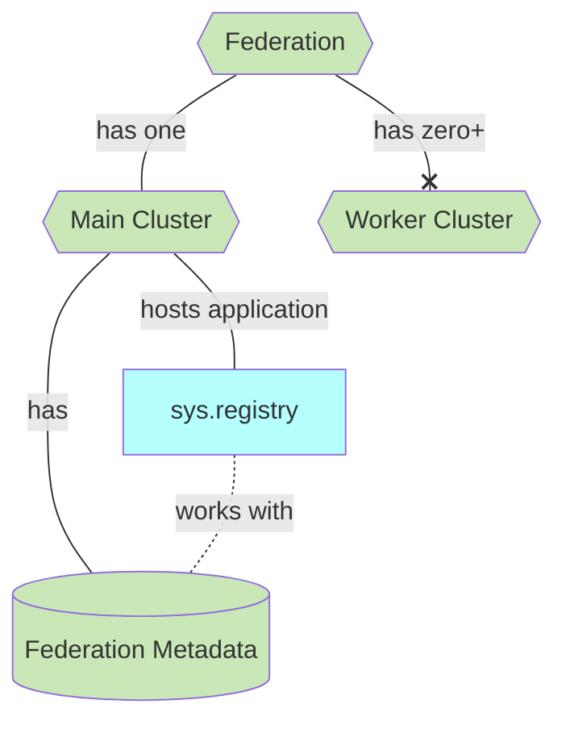

# Clusters & Federations

Voedger is engineered to store and process data across multiple regions, adhering to government regulations and ensuring low latency for clients. To accomplish this, Voedger leverages the concepts of **Clusters** and **Federations**.

## Clusters

Clusters are intended to operate **Voedger Applications** - backend applications developed specially for a **Voedger** platform. Voedger platform hides the complexity of managing the underlying infrastructure, allowing developers to focus on building their applications.

Under the hood, Voedger uses the following software:
- **Scylla**, a high-performance, distributed NoSQL database management system (DBMS), to store and process data
- **Grafana** for monitoring
- **Alertmanager** for alerting

All necessary software are installed and configured automatically by **ctool** utility.

Although a cluster can consist of just a single **Node**, for enhanced durability and high availability, it's advisable to maintain at least three nodes in a cluster.

Cluster architecture:

## Federation

Clusters are organized into a **Federation**. A Federation comprises multiple clusters situated in various regions. This structure enables the storage of data in numerous locations, significantly reducing latency for backend clients.

Federation structure is transparent to the developer. Voedger Applications interact with Voedger platform, which routes requests to the appropriate cluster.

The Federation structure consists of one **Main Cluster** and several **Worker Clusters**. The Main Cluster keeps metadata about the Federation and hosts the **Registry** (sys.registry) application for this purpose.

