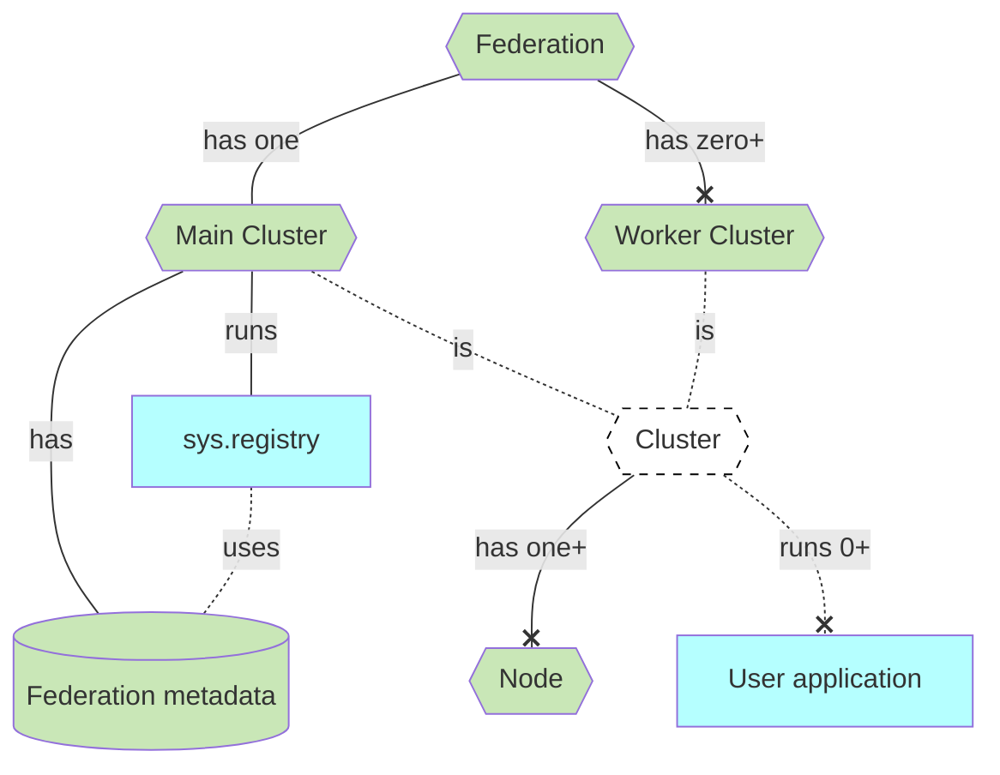

# Clusters & Federations

Voeder is designed to keep and process data in multiple regions, to follow governmental regulations and provide low latency for your clients. To achieve this, Voedger uses the concept of **clusters** and **federations**.

Data is kept and processed in **clusters**. A cluster can be a single **node**, but it is recommended to have at least three nodes in a cluster to provide durability and high availability. Cluster can run **User applications**.

Clusters are grouped into **federation**. A Federation is a group of clusters that are located in different regions. Federations are used to keep data in multiple regions and to provide low latency for your clients.

Federation has one **Main Cluster** and number of **Worker Clusters**. Main cluster is used to keep metadata about the Federation, for this purposes it runs the **Registry** (sys.registry) application.

