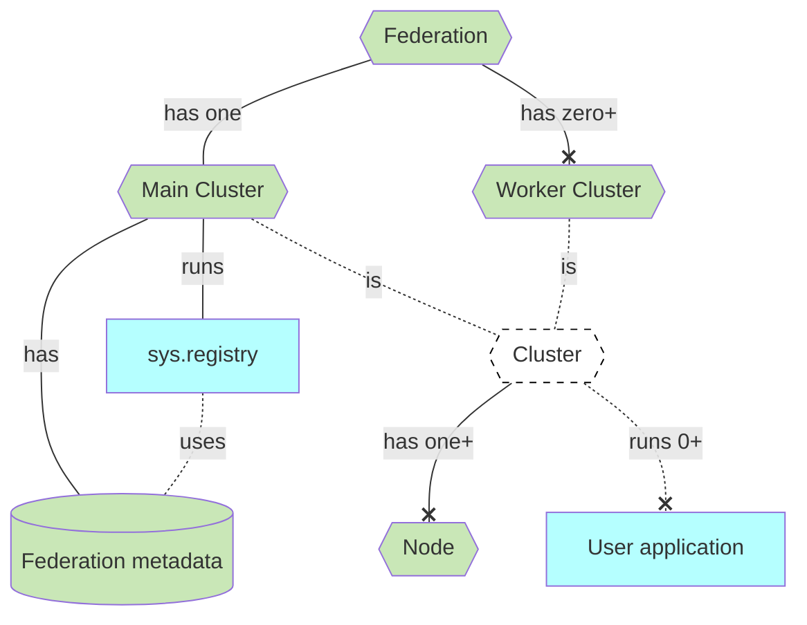

# Clusters & Federations

Voedger is engineered to store and process data across multiple regions, adhering to government regulations and ensuring low latency for clients. To accomplish this, Voedger leverages the concepts of **Clusters** and **Federations**.

Data is stored and processed in **Clusters**. Although a cluster can consist of a single **Node**, for enhanced durability and high availability, it's advisable to maintain at least three nodes in a cluster. Clusters are capable of running **Applications** and keeping their data.

Clusters are organized into a **Federation**. A Federation comprises multiple clusters situated in various regions. This structure enables the storage of data in numerous locations, significantly reducing latency for your clients.

A Federation is structured around one **Main Cluster** and several **Worker Clusters**. The Main Cluster keeps metadata about the Federation and hosts the **Registry** (sys.registry) application for this purpose.

