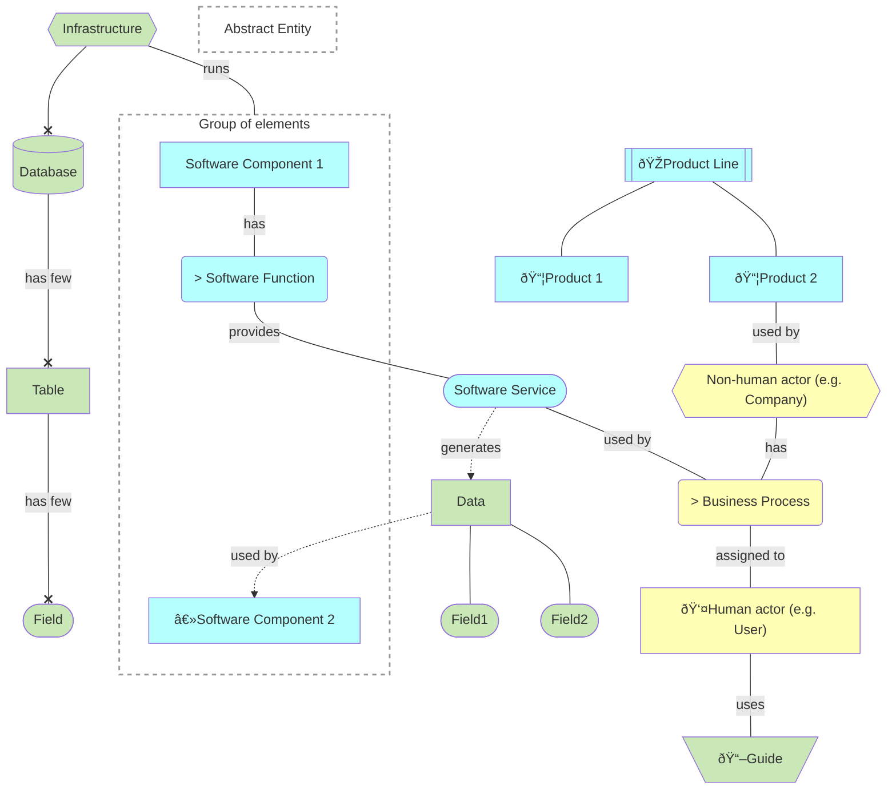

# Notation experiments

```mermaid
graph TD

  %% Entities =================================

  Infrastructure{{Infrastructure}}:::H
  Database[(Database)]:::H
  Table:::H
  Field([Field]):::H
  Data:::H
  DataField1([Field1]):::H
  DataField2([Field2]):::H
  AbstractEntity[Abstract Entity]:::G

  Guide[\📖Guide/]:::H

  ProductLine[["ðŸŽProduct Line"]]:::S
    ProductLine --- Product1[📦Product 1]:::S
    ProductLine --- Product2[📦Product 2]:::S

  SoftwareComponents:::G
  subgraph SoftwareComponents[Group of elements]
    SoftwareComponent["Software Component 1"]:::S
    SoftwareFunction("> Software Function"):::S
    SoftwareComponent2["※Software Component 2"]:::S
  end
  
  SoftwareService([Software Service]):::S  
  
  User["👤Human actor (e.g. User)"]:::B
  Company{{"Non-human actor (e.g. Company)"}}:::B
  BusinessProcess("> Business Process"):::B


  %% Relations =================================

  Infrastructure ---|runs| SoftwareComponents

  SoftwareComponent --- |has| SoftwareFunction
  SoftwareFunction --- |provides| SoftwareService

  Infrastructure --x Database
  Database ---x|has few| Table
  Table ---x|has few| Field

  SoftwareService -.->|generates| Data

  SoftwareService --- |used by| BusinessProcess
  BusinessProcess --- |assigned to| User

  User --- |uses| Guide

  Data -.->|used by| SoftwareComponent2

  Data --- DataField1
  Data --- DataField2
  
  Product2 --- |used by| Company
  Company --- |has| BusinessProcess

  classDef B fill:#FFFFB5,color:#333
  classDef S fill:#B5FFFF,color:#333
  classDef H fill:#C9E7B7,color:#333
  classDef G fill:#ffffff15, stroke:#999, stroke-width:2px, stroke-dasharray: 5 5
```