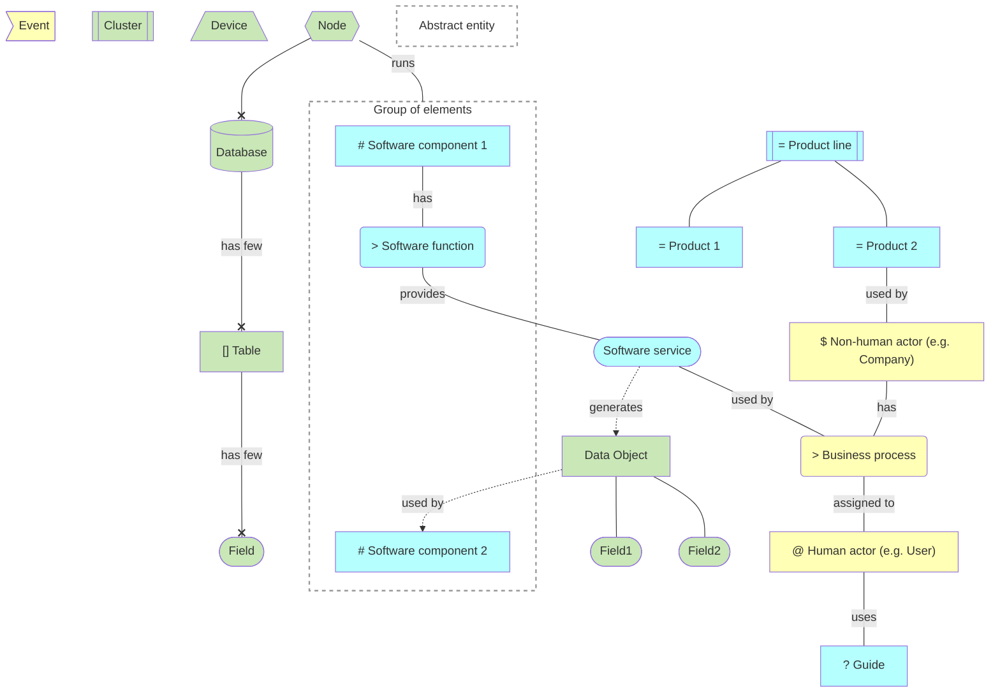

# Notation

Notation is based on:
- [ArchiMate](https://en.wikipedia.org/wiki/ArchiMate) (/ˈɑːrkɪmeɪt/ AR-ki-mayt; originally from Architecture-Animate), open and independent enterprise architecture modeling language
  - Brief description: [ArchiMate Metamodel For Enterprise Development](https://www.hosiaisluoma.fi/blog/archimate-metamodel/)
- [Entity–relationship model](https://en.wikipedia.org/wiki/Entity%E2%80%93relationship_model), describes interrelated things of interest in a specific domain of knowledge

## See also

- [notation-experiments.md](notation-experiments.md)