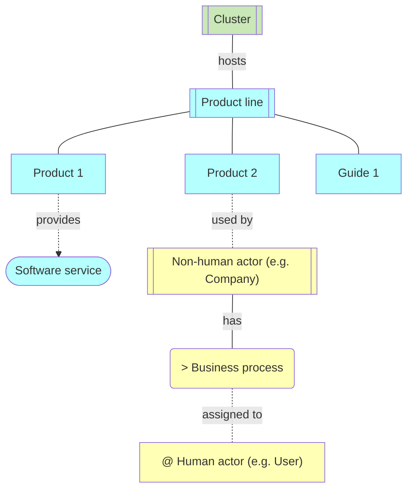
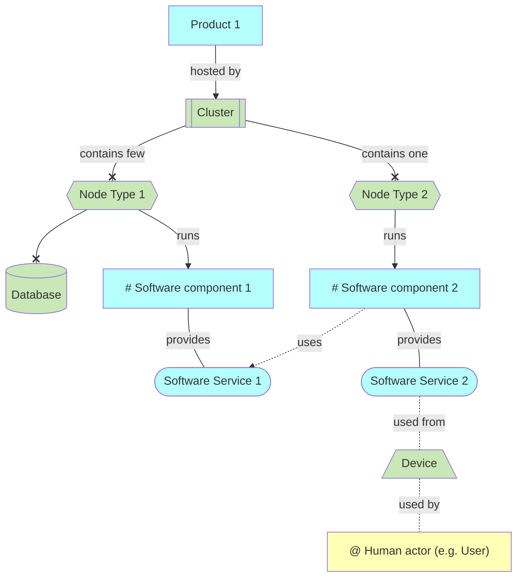
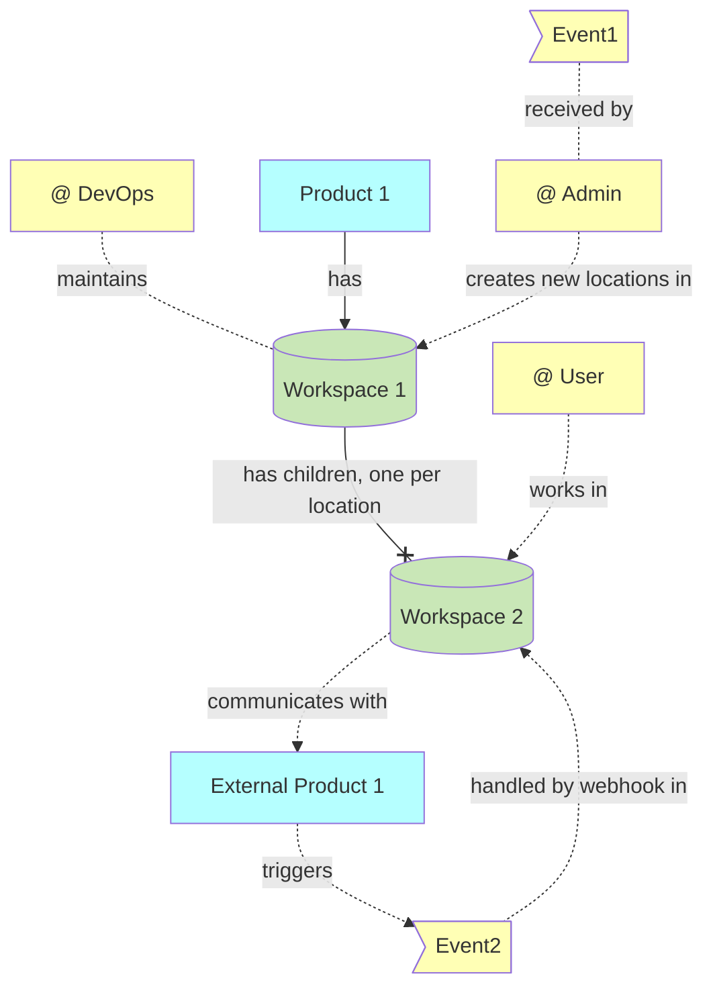
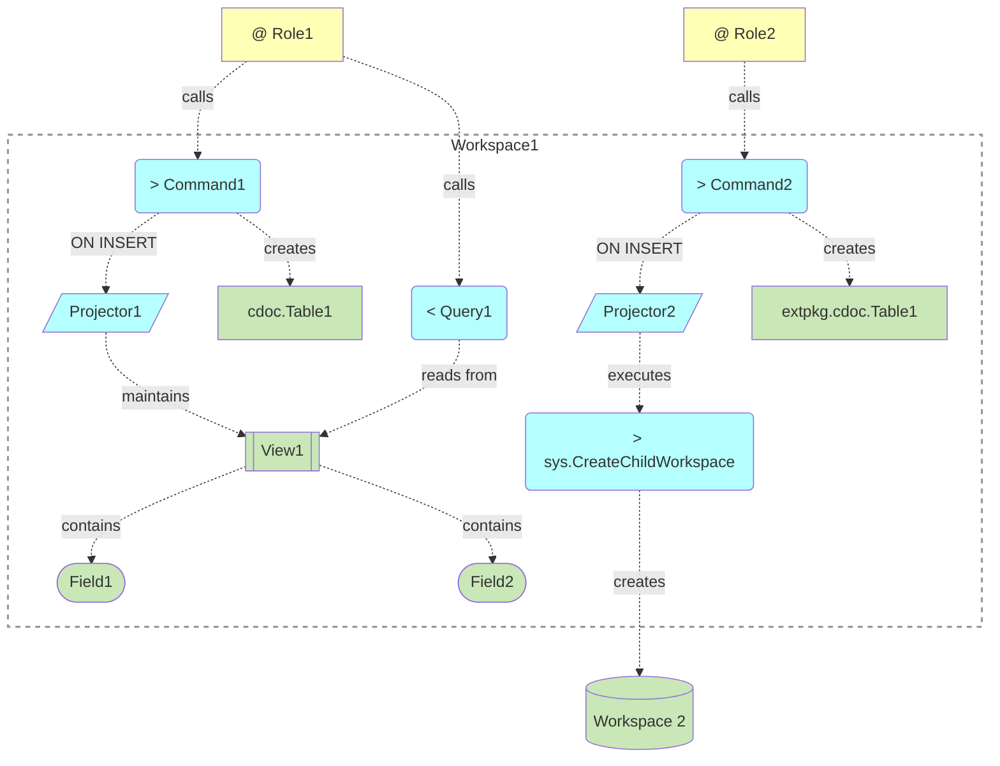

# Notation

Notation is based on:
- [ArchiMate](https://en.wikipedia.org/wiki/ArchiMate) (/ˈɑːrkɪmeɪt/ AR-ki-mayt; originally from Architecture-Animate), open and independent enterprise architecture modeling language
  - Brief description: [ArchiMate Metamodel For Enterprise Development](https://www.hosiaisluoma.fi/blog/archimate-metamodel/)
- [Entity–relationship model](https://en.wikipedia.org/wiki/Entity%E2%80%93relationship_model), describes interrelated things of interest in a specific domain of knowledge
- [C4 model](https://c4model.com/) for visualising software architecture

## C1: Context
Describes the context of the system: cluster, products, services, roles

## C2: Containers
### Infrastructure: nodes, databases, devices, software services and components

### Application: Workspaces, actors

## C3: Components
- Workspace components: views, projectors, tables, etc

## See also

- [notation-experiments.md](notation-experiments.md)